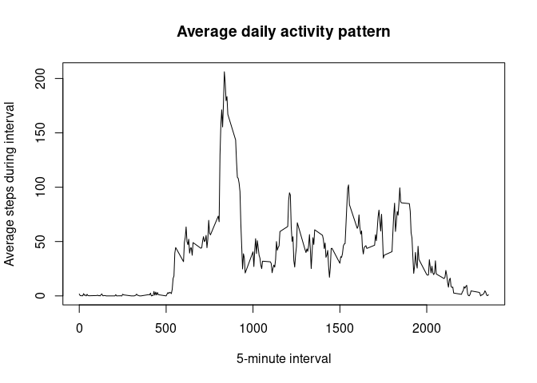
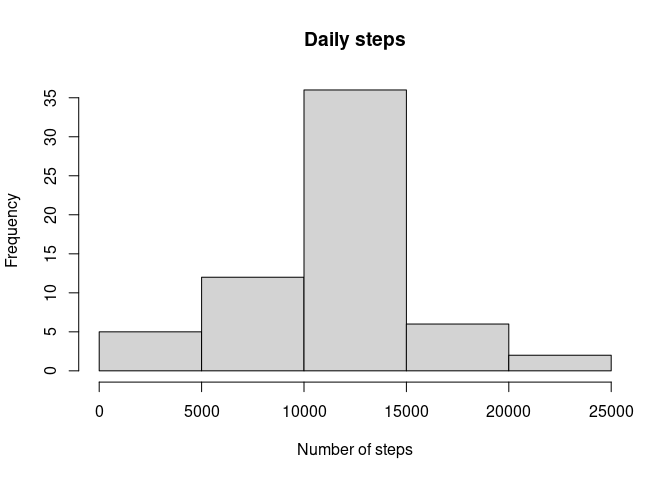
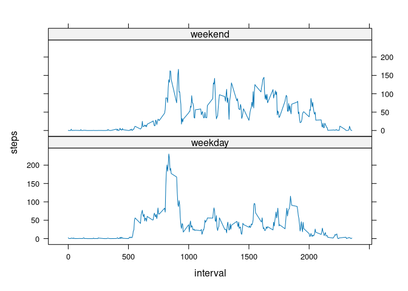

## Loading and preprocessing the data


```r
unzip("activity.zip")
activity <- read.csv("activity.csv")
```

## What is mean total number of steps taken per day?

Note that steps indicated as `NA` will be treated as 0.

```r
totals <- with(activity, tapply(steps, date, sum, na.rm = TRUE))
mean_steps <- mean(totals)
```

The mean total number of steps taken per day is **9354.2295082**.

## What is the average daily activity pattern?

```r
mean_interval_steps <- with(activity, tapply(steps, interval, mean, na.rm = TRUE))
plot(
  dimnames(mean_interval_steps)[[1]],
  mean_interval_steps, type = "l",
  main = "Average daily activity pattern",
  xlab = "5-minute interval",
  ylab = "Average steps during interval"
)
```

<!-- -->


## Imputing missing values
Where there are missing values, we will simply impute them with the average for that particular 5-minute interval for the other days.

First, we need to calculate the average steps for each interval for the non-missing intervals. So we take a subset of the data that contains only the complete cases.

```r
complete_activity <- activity[complete.cases(activity),]
```

Now we'll get the average steps for each interval like we did for the previous question.

```r
mean_interval_steps_complete <- with(complete_activity, tapply(steps, interval, mean))
```

Then we can impute the data where it is missing.

```r
steps_complete <- as.vector(mean_interval_steps_complete)
intervals <- dimnames(mean_interval_steps_complete)[[1]]

new_activity <- cbind(activity)

for (i in 1:nrow(new_activity)) {
  steps <- new_activity[i,]$steps
  if (!is.na(steps)) {
    next
  }
  interval <- new_activity[i,]$interval
  interval_index <- which(intervals == interval)
  steps_imputed <- steps_complete[interval_index]
  new_activity[i,]$steps <- steps_imputed
}
```

Finally, we can analyze the results of imputing the number of steps.

```r
totals <- with(new_activity, tapply(steps, date, sum))
hist(totals, main = "Daily steps", xlab = "Number of steps")
```

<!-- -->

```r
mean_steps <- mean(totals)
median_steps <- median(totals)
```

After the values are imputed, here are the results:  

* Mean steps per day: **10766.19**
* Median steps per day: **10766.19** 

Imputing the missing data increases the estimate for daily number of steps.

## Are there differences in activity patterns between weekdays and weekends?

First, we'll create a new factor variable. Either "weekday" or "weekend".


```r
days <- weekdays(as.Date(new_activity$date)) 
is_weekend <- function(day) {
  if(day == "Saturday" | day == "Sunday") "weekend" else "weekday"
}
new_activity$weekend_or_weekday <- sapply(days, is_weekend)
```

Now we'll take the average number of steps taken in each interval, grouped by weekends and weekdays.


```r
steps_weekday <- subset(new_activity, weekend_or_weekday == "weekday")

mean_interval_steps_weekday <- with(steps_weekday, tapply(steps, interval, mean))

df_weekday <- data.frame(
  interval = as.numeric(dimnames(mean_interval_steps_weekday)[[1]]),
  steps = mean_interval_steps_weekday,
  weekday_or_weekend = rep("weekday", length(mean_interval_steps_weekday))
)

steps_weekend <- subset(new_activity, weekend_or_weekday == "weekend")

mean_interval_steps_weekend <- with(steps_weekend, tapply(steps, interval, mean))

df_weekend <- data.frame(
  interval = as.numeric(dimnames(mean_interval_steps_weekend)[[1]]),
  steps = mean_interval_steps_weekend,
  weekday_or_weekend = rep("weekend", length(mean_interval_steps_weekend))
)

df <- rbind(df_weekday, df_weekend)
```

Finally, we'll create a panel plot for the two subsets using the lattice plotting system.


```r
library(lattice)
xyplot(
  steps ~ interval | weekday_or_weekend,
  data = df,
  layout = c(1,2),
  type = "l"
)
```

<!-- -->
